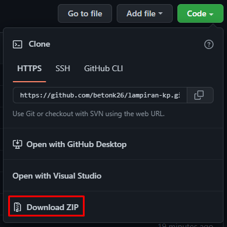

# NOTES!

#### deskripsi

berisikan lampiran - lampiran form Kerja Profesi untuk memudahkan mahasiswa dalam penyusunan laporan.

## Cara Menggunakannya

#### menggunakan .GIT

sebelum menggunakan .GIT, Laptop/PC harus sudah terinstall GIT terlebih dahulu. Jika belum install silakan download:

- [MacOS](https://git-scm.com/download/mac)
- [Windows](https://git-scm.com/download/win)
- [Linux/Unix](https://git-scm.com/download/linux)

Jika sudah menginstall (windows) langkah selanjutnya adalah:

- buka folder (contoh: lampiran-kp)
- click kanan
- git bash here...

  ```
  git clone https://github.com/betonk26/lampiran-kp.git
  ```

#### Download ZIP




#### Penutup

sekian

## notes
coming soon
- formulir pengajuan sidang
- formulir revisi laporan kerja profesi
- formulir tanda terima hasil akhir laporan kerja profesi
